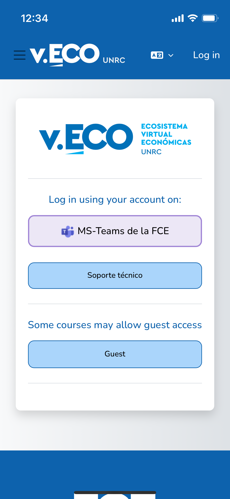
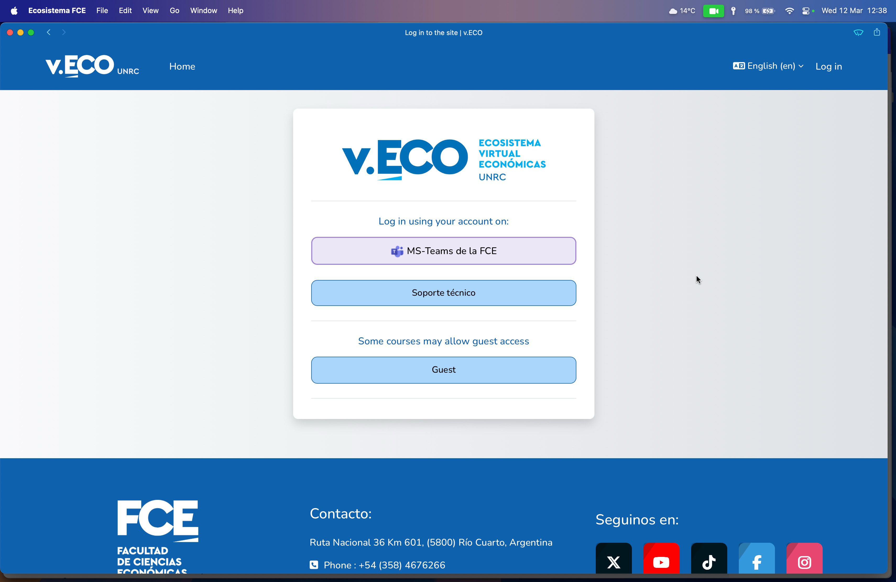
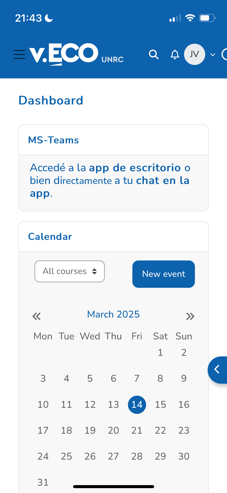
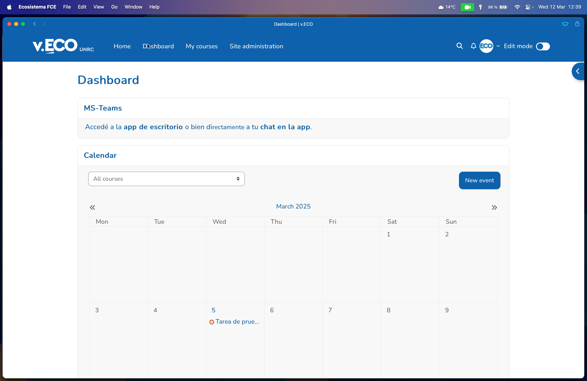
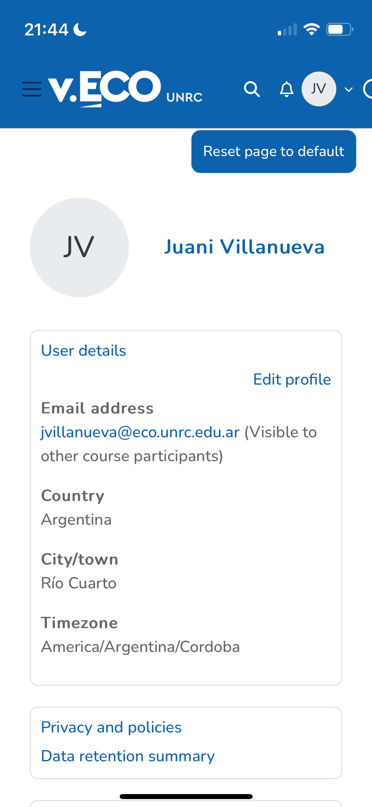
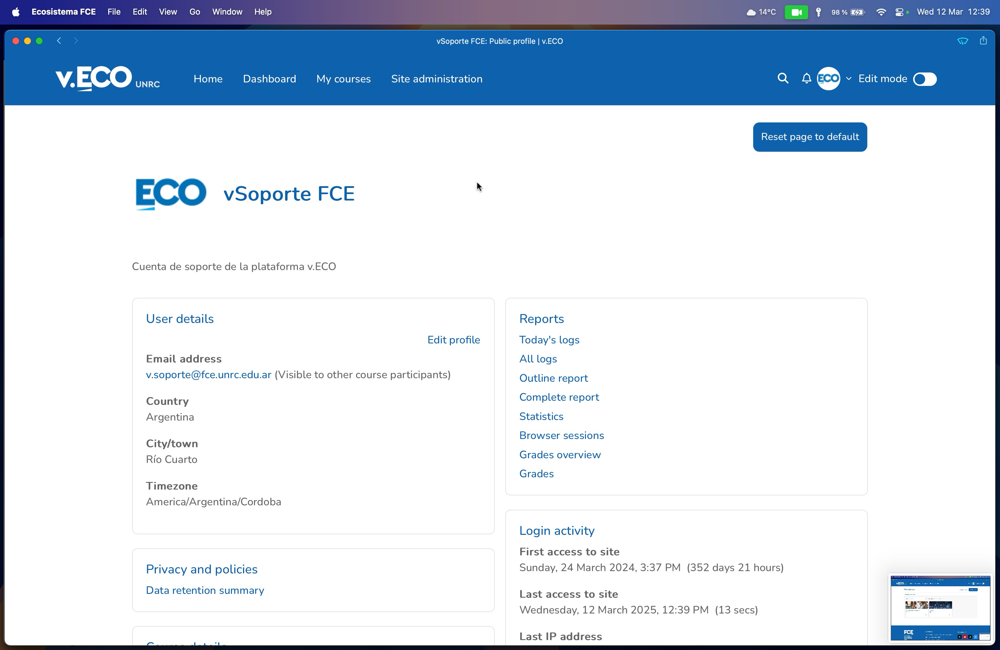
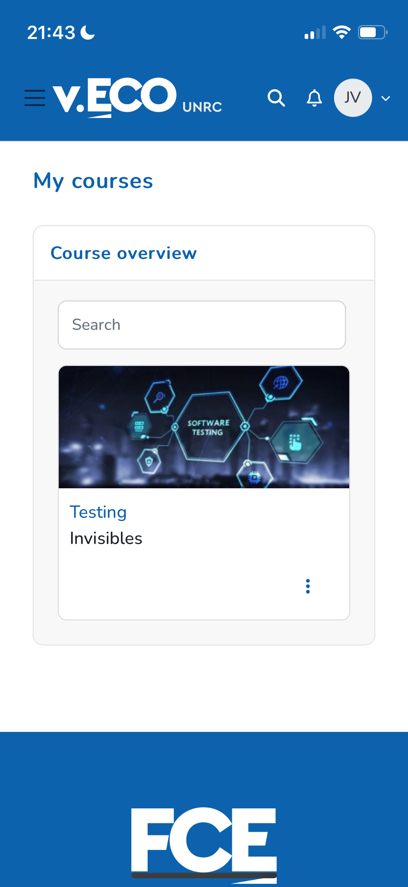
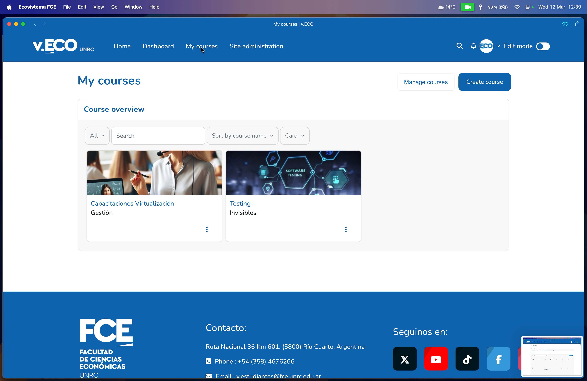

# Ecosistema FCE: Moodle PWA

This repository contains the implementation of a **Progressive Web App (PWA)** for the Moodle instance of **v.eco.unrc.edu.ar**. The goal is to improve the Moodle user experience by enabling app installation, a custom home screen, and better support for mobile devices.

## Features

- UI/UX optimized for PWA on both desktop and mobile devices.
- Shortcuts: long-press the app icon (Android and Windows) to quickly access basic PWA features.
- Standard and **maskable** icons for Android and iOS.
- iOS splash screens via `<meta>` tags (for apps added from Safari).
- Screenshots of the app on various devices (iOS and Android) to provide a more complete installation experience.

## Live site

You can test the PWA on the Moodle site here:

[https://v.eco.unrc.edu.ar/](https://v.eco.unrc.edu.ar/)

## Screenshots

| Mobile | Desktop |
|--------|---------|
|  |  |
|  |  |
|  |  |
|  |  |

## Resources

- PWA Guide: [https://web.dev/progressive-web-apps/](https://web.dev/progressive-web-apps/)
- Official Moodle Documentation: [https://docs.moodle.org/](https://docs.moodle.org/)

## Notes

The PWA has been tested on the following operating systems:
  - macOS: Safari, Chromium-based browsers, Firefox.
  - Windows: Chromium-based browsers, Firefox.
  - iOS: Safari, Chromium-based browsers, Firefox.
  - Android: Chromium-based browsers, Firefox.

## License

This project is licensed under the MIT License - see the [LICENSE](LICENSE) file for details.

---

# Ecosistema FCE: Moodle PWA

Este repositorio contiene la implementación de una **Progressive Web App (PWA)** para la instancia de Moodle de **v.eco.unrc.edu.ar**. El objetivo es mejorar la experiencia de usuario en Moodle permitiendo la instalación como aplicación, pantalla de inicio personalizada y mejor soporte para dispositivos móviles.

## Características

- UI/UX optimizada para PWA en escritorio y móvil.
- Atajos: mantén presionado el ícono de la app (Android y Windows) para tener rápido acceso a funcionalidades básicas de la PWA.
- Iconos estándar y **maskable** para Android e iOS.
- Splash screens para iOS mediante etiquetas `<meta>` (para apps añadidas desde Safari).
- Capturas de pantalla del funcionamiento de la app en varios dispositivos (iOS y Android), para permitir una UI de instalación más completa.

## Sitio en vivo

Puedes probar la PWA en el sitio de Moodle aquí:

[https://v.eco.unrc.edu.ar/](https://v.eco.unrc.edu.ar/)

## Capturas de pantalla

| Móvil | Escritorio |
|-------|------------|
|  |  |
|  |  |
|  |  |
|  |  |

## Recursos

- Guía de PWAs: [https://web.dev/progressive-web-apps/](https://web.dev/progressive-web-apps/).
- Documentación oficial de Moodle: [https://docs.moodle.org/](https://docs.moodle.org/).

## Notas

La PWA fue probada en los siguientes sistemas operativos:
  - macOS: Safari, navegadores basados en Chromium, Firefox.
  - Windows: navegadores basados en Chromium, Firefox.
  - iOS: Safari, navegadores basados en Chromium, Firefox.
  - Android: navegadores basados en Chromium, Firefox.

## Licencia

Este proyecto está licenciado bajo la Licencia MIT - ver el archivo [LICENSE](LICENSE) para más detalles.
